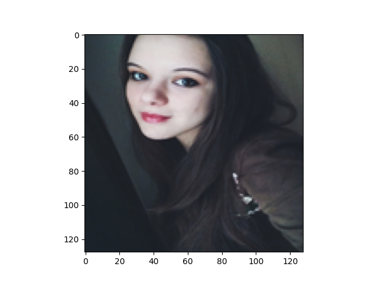

Michał Naruniec\
360386

# Deep Neural Networks
## Assignment 2

### Usage

There are two scripts: train_network and evaluate_network.

The first one runs the training  of a fresh network.

The second one loads a snapshot, evaluates it on the given dataset and gathers 50 samples with highest loss.

### Architecture

I used almost original U-Net described [here](https://lmb.informatik.uni-freiburg.de/people/ronneber/u-net/).
I added batch normalization before each convolution and paddings, so that only max pooling and transpose convolution changes the size.
Below you can see my diagram of the architecture:

### Data augmentation

I implemented two "levels" of augmentation plus self-augmentation.

First, I extend dataset four times, by applying identity, 90 and 270 degree rotations and horizontal flip.
I use the same four transformations for self-augmentation.

On top of that, I use 4 transformations from the Albumentations library on the fly.
This means that in each epoch I use 8000 images, but each of them has 0.15 chance to have any of four transformations applied: Blur, JpegCompression, HueSaturation (aka. ColorJitter), GaussNoise.

However, the best model I trained used only one on-the-fly augmentation (Blur). Further ones slightly decreased the evaluation metrics.

### Evaluation and analysis

#### Test set metrics

The best model achieved 96.74% pixel accuracy, and 93.83% IoU on the test set.

#### Worst case scenarios

I have gathered images with largest loss values from both training and test datasets.
I haven't noticed anything special about the training samples

| | | | | |
|:---:|:---:|:---:|:---:|:---:|
|  |  |  |  |

The test samples do reveal a pattern. They display people which are pasted onto the background.
Their edges are irregular, especially when you san see singular hairs.
Sometimes there are also occlusions, like in the pictures with the girl of Asian descendance.
The network probably has a hard time on the edges, and might be also confused by differences in the lighting.
The train dataset samples did not have these anomalies, so it might be the case that it does not have such images to train on.

| | | | | |
|:---:|:---:|:---:|:---:|:---:|
|  |  |  |  |
|  |  |  |  |
|  |  |  |  |
|  |  |  |  |
|  |  |  |  |

